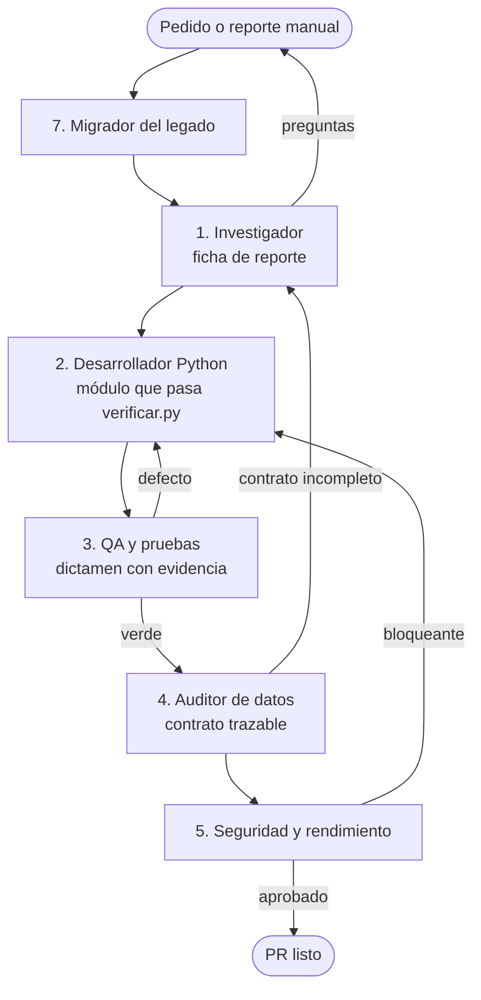

# Pipeline de Agentes — Reportes Automatizados

Cinco agentes secuenciales atienden el ciclo de vida de cualquier reporte. Cada uno recibe un artefacto y entrega otro: son compuertas con criterio de rechazo.



| # | Agente | Entrega | Rechaza cuando… |
|---|---|---|---|
| 1 | [Investigador](./01-investigador-requerimientos.md) | ficha de reporte | falta base, corte, solicitante, regla de aborto o salida |
| 2 | [Desarrollador Python](./02-desarrollador-python.md) | módulo + registro | la ficha es inviable o contradice el código |
| 3 | [QA](./03-tester-qa.md) | dictamen | vacío y error se confunden |
| 4 | [Auditor de datos](./04-auditor-datos-contratos.md) | contrato y docs vigentes | la cifra no significa lo documentado |
| 5 | [Seguridad y rendimiento](./05-revisor-seguridad-rendimiento.md) | dictamen de riesgo | hay secreto nuevo o escritura innecesaria |

## Transversales
| Agente | Cuándo | Rechaza cuando… |
|---|---|---|
| [Curador de gobernanza](./06-curador-de-gobernanza.md) | periódicamente o si `verificar.py` falla por algo ajeno | se regenera línea base/inventario solo para destrabar |
| [Migrador del legado](./07-migrador-legado.md) | antes de la fase 1 | el contrato no tiene fuente legada |
| [Diseñador web](./08-disenador-web.md) | al crear o cambiar una pantalla de la web | una regla vive solo en la web, hay color fuera de tokens o se esquiva `lib/api.ts` |

## Uso
Cada archivo trae frontmatter (`name`, `description`, `tools`) y un prompt de sistema. Puede usarse como subagente (copiar a `.claude/agents/`), como prompt directo o como checklist humano.

**Regla común: cuando la documentación y el código discrepan, gana el código.**

```bash
python governance/scripts/verificar.py
python governance/scripts/validar_gobernanza.py --listar
```
